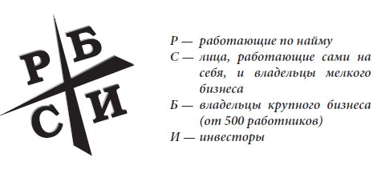

<!-- @nested-tags:Cashflow quadrant -->

# Конспект для "Квадрант денежного потока"

Путь есть цель - т.е. цель жизни в том, чтобы найти свой путь в жизни

---

Многим людям не удается добиться успеха лишь потому, что они не способны перенести достаточного количества поражений

---

Успех - плохой учитель, учиться нужно на ошибках. Нельзя добиться успеха, не испытав неудачи

---

Будь осторожен, когда получаешь рекомендации и всегда учитывай из какого квадранта исходит совет

---

Никогда не спрашивайте у страхового агента, нужен ли вам страховой полис

---

В мире финансовой отчетности выделяют три вида дохода:

1. заработанный
2. портфельный
3. пассивный

Инвестирование:

1. с целью увеличения денежного потока
2. с целью прироста капитала

Каждый капиталист должен обладать навыком делания денег, используя ДДЛ

---

Почему ты считаешь потерю денег хорошей сделкой?

---

Финансовый интеллект определяет не столько то, как много денег вы делаете, сколько то, как много их остается в вашем распоряжении, насколько эффективно они работают на вас и сколько поколений семьи вы сможете ими обеспечить

---

Ипотека - это ссуда под залог

Дериватив - это производное (апельсиновый сок - производное апельсина)

---

Прибыль создается в тот момент, когда ты покупаешь, а не когда продаешь

---

Необходимо понимать разницу между фактом и мнением

---

Отступить ты сможешь в любой момент, так зачем отступать сейчас?

---

Я достигаю большего даже когда делаю меньше чем могу
Ставьте каждый день перед собой достижимые цели
