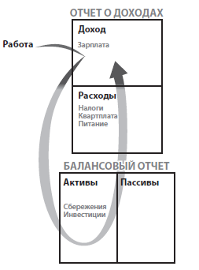

<!-- @nested-tags:Rich Dad Poor Dad -->

# Конспект для "Богатый папа, бедный папа"

- Богатые люди покупают активы
- У бедных есть только расходы
- Средний класс покупает пассивы, которые считает активами

---

- Актив - это то, что приносит деньги в мой карман
- Пассив - это то, что вынимает деньги из моего кармана

---

Виды активов:

1. Бизнес, который не требует моего присутствия (если я вынужден там работать, то это уже работа, а не бизнес)
2. Акции
3. Облигации
4. Взаимные фонды
5. Недвижимость, приносящая доход
6. Долговые расписки и векселя
7. Гонорары за интеллектуальную собственность
8. Любая другая собственность, которая имеет ценность, приносит доход или растет в цене и легко продается

---

Занятие собственным бизнесом - это создание и сохранение сильной колонки активов. Если туда попал доллар - не давайте ему уйти

---

Когда вы приступите к разработке своей общей финансовой стратегии, стоит как можно больше узнать о защите, которую может обеспечить вашему бизнесу и активам статус юридического лица

---

Финансовый интеллект складывается из 4х базовых технических навыков

1. Бухгалтерский учет
2. Инвестирование
3. Понимание рынков (маркетинг?)
4. Законодательство

---

"Мне не нравится ходить в спортзал, но я хожу туда, потому что хочу себя лучше чувствовать и дольше прожить"

---

Вместо "Я не могу себе это позволить" - "Как я могу это себе позволить?"

---

Чтобы начать собственное дело, необходимо овладенть тремя навыками управления:

1. Денежным потоком
2. Людьми
3. Личным временем

---

Люди, которые сначала платят себе:

---

Сбережения существуют только для того, чтобы делать новые деньги

---

Опытные инвесторы обращают внимание не только на ROI - коэффициент окупаемости инвестиции.
Также их интересуют активы, которые достанутся им даром после того, как они вернут свои инвестиции

---

## **NB Прибыль приносит покупка, а не продажа**

---

## **Сначала ищите людей, которые готовы купить. Потом ищите того, кто готов продать.**

---
